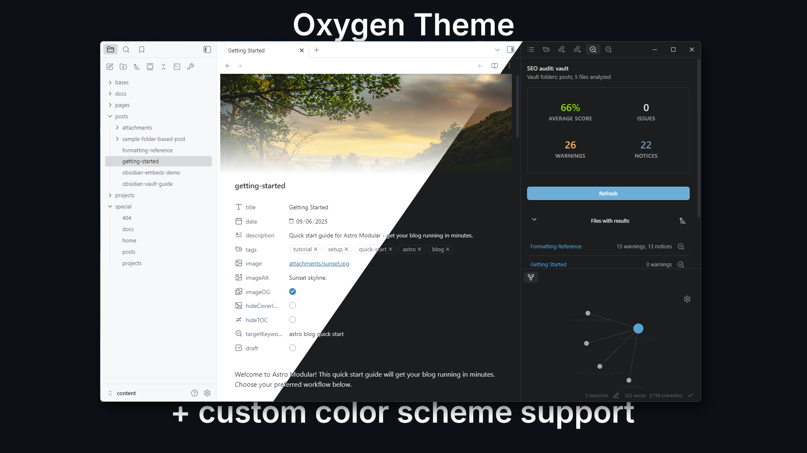

# Oxygen Theme for Obsidian



A fork of [Minimal](https://github.com/kepano/obsidian-minimal) with a custom Oxygen color scheme as the default. Oxygen extends Minimal's excellent foundation with enhanced color scheme management and custom preset functionality.

## What Makes Oxygen Different

- **Calm color scheme**: Oxygen's carefully crafted color palette prioritizes focus.
- **Polished animations**: Smooth transitions and subtle entrance effects for workspace panes, modals, and menus with customizable speed and motion styles.
- **Advanced custom presets**: Create, import, and share custom color schemes with an intuitive interface using [Oxygen Theme Settings](https://github.com/davidvkimball/obsidian-oxygen-settings)
- **Full Style Settings integration**: Supports anything from Minimal in the [Style Settings](https://github.com/mgmeyers/obsidian-style-settings) plugin

For general features and documentation, see [minimal.guide](https://minimal.guide).

## Installation

Oxygen is not yet available in the Community Themes section. Install using [BRAT](https://github.com/TfTHacker/obsidian42-brat) or manually:

### BRAT

1. Install the [BRAT](https://github.com/TfTHacker/obsidian42-brat) plugin from Community Plugins
2. Open BRAT settings (Settings → BRAT)
3. Click "Add Beta Theme" and enter: `https://github.com/davidvkimball/obsidian-oxygen`
4. Go to `Appearance` settings and select "Oxygen" from the theme dropdown

**Install the Companion Plugin** (Highly Recommended)

The Oxygen Theme Settings plugin is also not yet in Community Plugins. Install via BRAT:

1. In BRAT settings, click "Add Beta plugin"
2. Enter: `https://github.com/davidvkimball/obsidian-oxygen-settings`
3. Enable the plugin in Settings → Community Plugins

### Manual

1. Download the latest release from the [Releases page](https://github.com/davidvkimball/obsidian-oxygen/releases) and navigate to your Obsidian vault's `.obsidian/themes/` directory.
2. Create a new folder called "Oxygen" and ensure `manifest.json` and `theme.css` are in it.
3. In Obsidian, go to **Settings > Appearance** and then enable "Oxygen."

**Install the Companion Plugin** (Highly Recommended)

1. Download the latest release from the Oxygen Theme Settings [Releases page](https://github.com/davidvkimball/obsidian-oxygen-settings) and navigate to your Obsidian vault's `.obsidian/plugins/` directory.
2. Create a new folder `oxygen-settings` and ensure `manifest.json`, `main.js`, and `styles.css` are in there.
3. In Obsidian, go to **Settings > Community Plugins**, enable "Community Plugins" if not already enabled, and then enable "Oxygen Theme Settings."

## Companion Plugins

- [Oxygen Theme Settings](https://github.com/davidvkimball/obsidian-oxygen-settings) - Recommended for accessing color schemes, custom presets, and theme features. Includes advanced color management functionality.
- [Style Settings](https://github.com/mgmeyers/obsidian-style-settings) - Optional. Create custom color schemes through a visual interface with full variable customization.

For general features like focus mode, image grids, helper classes, alternate checkboxes, and more, see the [Minimal documentation](https://minimal.guide).

## Color Schemes

Oxygen offers the same color schemes as Minimal, with Oxygen as the default instead. Switch between schemes using [Oxygen Theme Settings](https://github.com/david/obsidian-oxygen-settings).

**Built-in schemes:** Oxygen (default), Minimal (original), Atom, Ayu, Catppuccin, Dracula, Eink, Everforest, Flexoki, Gruvbox, macOS, Nord, Rose Pine, Sky, Solarized, and Things.

## Custom Presets

Oxygen's custom preset (via Oxygen Theme Settings) functionality extends beyond Minimal's capabilities:

- **Create custom color schemes** with an intuitive color picker interface
- **Import any Obsidian theme** and extract its color palette automatically
- **Export and share** presets as JSON or CSS files
- **Smart color mapping** that automatically detects light/dark mode colors
- **Live preview** of changes as you design

Access custom presets through the "Custom Presets" tab in Oxygen Theme Settings. See `CUSTOM_PRESET_GUIDE.md` for detailed documentation.

## Animations

Oxygen includes smooth, polished animations throughout the interface to enhance the user experience:

- **Entrance effects**: Workspace panes, modals, and menus fade in with subtle scale and blur effects
- **Smooth transitions**: Sidebars, tabs, ribbons, and focus mode elements transition smoothly between states
- **Customizable speed**: Choose between normal, fast, or disabled animations via Style Settings
- **Motion styles**: Two easing curves available—refined (default) for subtle elegance, or playful for a bouncier feel
- **Accessibility**: Automatically respects your system's `prefers-reduced-motion` setting

These are based off of the animations found in the [Baseline](https://github.com/aaaaalexis/obsidian-baseline) theme.

### Using Style Settings

For even deeper customization, use the [Style Settings plugin](https://github.com/mgmeyers/obsidian-style-settings) to modify individual CSS variables. This gives you granular control over colors, fonts, sizes, and spacing.

## Developers

**Build Setup**

```bash
sudo gem install sass
npm install -g grunt-cli
npm install
```

**Local Development**

Rename `.env.example` to `.env` and update `OBSIDIAN_PATH` to your vault's theme folder for live reload.

```bash
# Fast development watch (recommended)
npx grunt

# Full production build
npx grunt build
```

Development watch creates `Oxygen.css` (unminified) and auto-copies to your vault. Production build creates both `theme.css` (minified) and `Oxygen.css` (unminified).

## License

Oxygen is licensed under the MIT License. You may modify and redistribute the code, but must preserve the copyright and license notice in your CSS file.

**If you distribute a fork of Oxygen, please keep [@kepano](https://github.com/kepano)'s [Buy me a coffee](https://www.buymeacoffee.com/kepano) link from Minimal in your README.**

Oxygen is based on the Minimal theme and is regularly updated to stay current with Obsidian releases. To stay up-to-date with improvements, consider using [GitHub's fork feature](https://docs.github.com/en/get-started/quickstart/fork-a-repo) to merge updates into your fork.

## Disclaimer

This theme is provided as-is. It modifies significant parts of the Obsidian interface and may break with future Obsidian updates or conflict with custom CSS snippets.

## Credits

[Minimal](https://github.com/kepano/obsidian-minimal), the theme upon which this is based.
[Baseline](https://github.com/aaaaalexis/obsidian-baseline) theme for the animation effects and some feature ideas.
